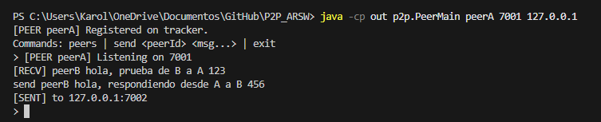

# P2P_ARSW

## Autores
* Carolina Cepeda Valencia
* Deisy Lorena Guzman Cabrales
* Jared Sebastian Farfan Guevara

## Estructura de archivos

```markdown

src/p2p/
├── Peer.java             # objeto en la red que puede pedir y compartir mensajes
├── PeerMain.java         # Clase principal para iniciar y configurar la ejecución de un Peer.
├── Protocol.java         # Define el formato y las reglas de comunicación entre Peers y el Tracker.
├── Tracker.java          # Lógica de registro de mensajes y localización de Peers.
└── TrackerServer.java    # Clase principal para iniciar el servidor de seguimiento (Tracker).
```


## Cómo ejecutar correctamente

* Se requiere Java 11 o superior

Se necesitan **3 terminales separadas** (una para el Tracker y una para cada Peer):

**Terminal 1: Tracker Server**
```bash
java -cp out p2p.TrackerServer
```

**Terminal 2: Peer A**
```bash
java -cp out p2p.PeerMain peerA 7001 127.0.0.1
```

**Terminal 3: Peer B**
```bash
java -cp out p2p.PeerMain peerB 7002 127.0.0.1
```

**Importante:** Cada `PeerMain` debe ejecutarse en su propia terminal. Esto es porque cada `consoleLoop()` lee de `System.in`, por lo que,si se ejecutan dos peers en la misma terminal, ambos competirán por la entrada estándar y no podrán escribir comandos en ninguno.

## Comandos disponibles en cada Peer

Una vez que los peers estén corriendo, se pueden usar estos comandos en la consola de cada uno:

- **peers**: Lista todos los peers registrados en el tracker.

    

- **send <peer_name> <mensaje>**: Envía un mensaje a otro peer (ej: `send peerB hola`).



## ¿Qué es P2P?
**P2P (peer to peer)** es un modelo de red en el que los nodos (peers) se comunican directamente entre sí, sin necesidad de un controlador único, esto se debe a que el control se distribuye entre los mismos nodos al tomar la función de servidor y cliente cuando es necesario. En este proyecto se implementa un modelo híbrido, donde existe un tracker que se encarga de mantener un registro de los peers que se encuentran en la red y de facilitar la comunicación entre ellos.

### Características principales 
*   **Descentralización**: No existe un servidor único que controle la red, lo que la hace más resistente a fallos.
*   **Autonomía**: Cada peer es independiente y puede conectarse o desconectarse de la red cuando lo desee.
*   **Escalabilidad**: La red puede crecer sin necesidad de aumentar la complejidad del sistema.

## Protocolo de comunicación
Se implementa el protocolo P2PProtocol.java que define las constantes de los comandos y las funciones para construir y dar formato a los mensajes. Los comandos principales que se han reconocido son:

- REGISTER: Registra un peer en el tracker.
- LIST: Lista todos los peers registrados en el tracker.
- MSG: Envía un mensaje a otro peer.
- OK: Indica que un comando se ejecutó correctamente.
- ERR: Indica que un comando falló.
- PEERS: Envía la lista de peers registrados en el tracker.

La estructura se basa en el patrón de comando: `COMANDO ARG1 ARG2 ...`. Gracias a la implementación de la clase `Protocol.java`, se logra una presentación uniforme de los mensajes, permitiendo que cualquier instrucción sea procesada bajo el mismo esquema de argumentos sin importar su tipo. Esto ultimo trayendo claras ventajas para la mantenibilidad y calidad del código.
```
